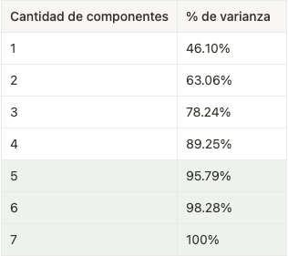
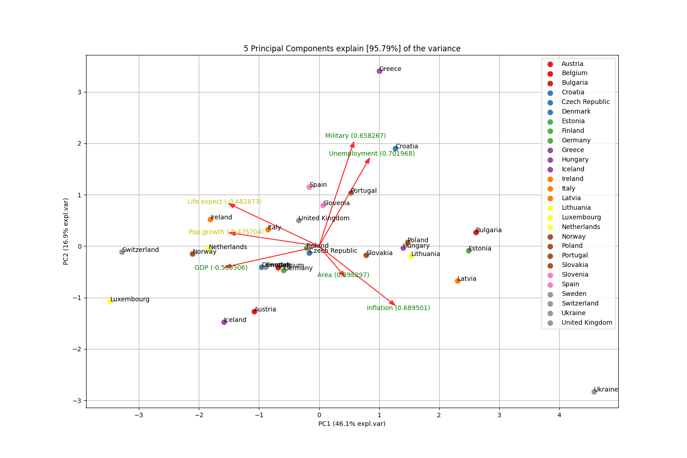

##Componentes Principales

---

1. Leemos el dataset
2. Estandarizamos las variables porque se observa una diferencia de magnitud entre ellas

```
 df = pd.read_csv(r'europe.csv')
 features = ['Area', 'GDP', 'Inflation','Life.expect','Military','Pop.growth','Unemployment']
 x = df.loc[:, features].values
 countries = df.loc[:, ['Country'][0]].values

 scaler = StandardScaler()
 scaler.fit(x)
 x = scaler.transform(x)
```
3. Calculamos componentes principales
```
 model = pca(n_components=5)
 results = model.fit_transform(x,col_labels=features,row_labels=countries)
 fig, ax = model.biplot()
```
---
Para el cálculo de componentes principales utilizamos la librería pca

---
###Conclusiones



